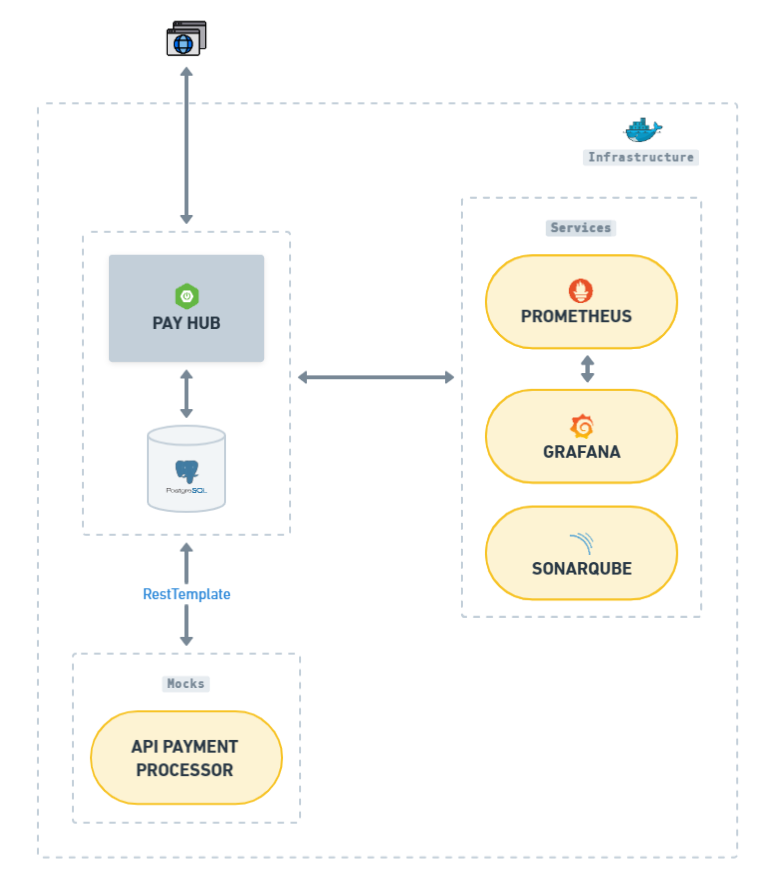
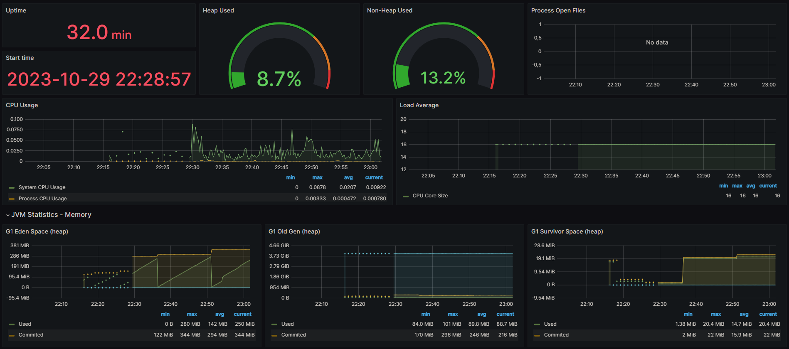
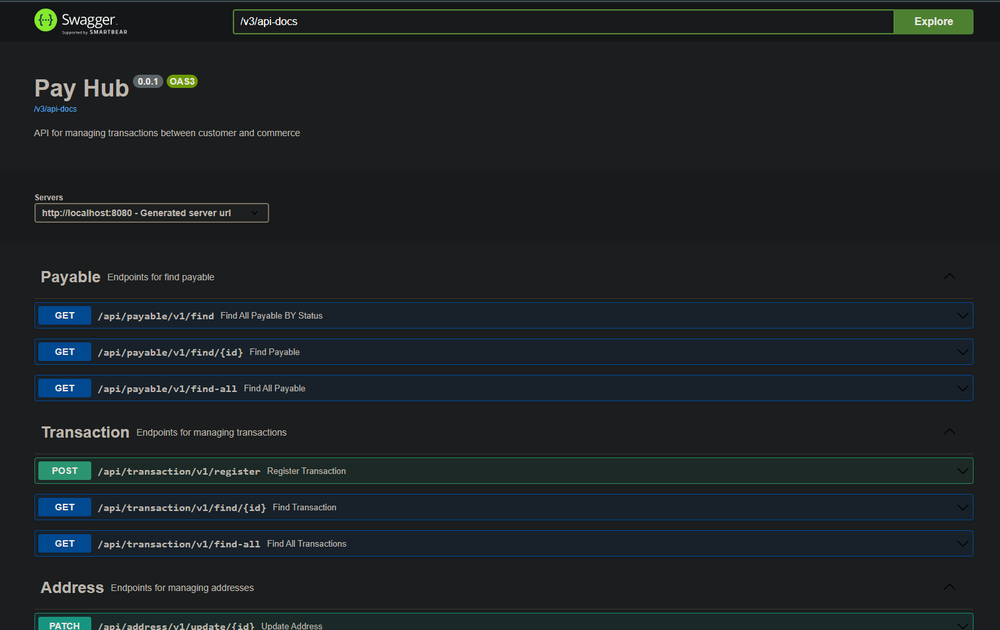

# Pay Hub ️👨‍💻

<p align="center">
  
</p>


É uma aplicação de gerenciamento de transações de pagamento entre clientes e estabelecimentos comerciais.
Ele permite aos usuários automatizar o rastreamento de transações de pagamentos em cartões de débito e crédito,
simplificando todo o processo de contabilidade.

**OBS:**
O intuito deste projeto é aplicar os conhecimentos o spring framework e suas tecnologias, visando criar um sistema 
escalável e resiliente que facilite o desenvolvimento, implantação e manutenção.

## Funcionalidades
- Gerenciamento de usuários
- Gerenciamento de empresas
- Gerenciamento e rastreamento de transações
- Geração de relatórios
- Schedules

## Infraestrutura

É uma arquitetura monolítica que se baseia nas ferramentas e bibliotecas do Spring Framework. Além disso, faz uso de 
containers Docker e serviços de observabilidade para aprimorar a escalabilidade, a disponibilidade e a capacidade de 
diagnóstico do sistema.

Na imagem abaixo é possível visualizar toda a organização da intraestrutura:

<p align="center">
  
</p>

Foi utilizado o [mocky.io](https://designer.mocky.io/) para simular a integração com a api de processamento do pagamento.

## Monitoramento

O uso do Grafana em conjunto com o Prometheus e o Spring Actuator é uma abordagem poderosa para monitorar e visualizar 
o desempenho de aplicativos baseados em Spring. Essa combinação de ferramentas fornece uma visão abrangente das 
métricas e estatísticas dos seus serviços, permitindo uma gestão mais eficaz e rápida identificação de problemas de desempenho. 

<p align="center">
  
</p>

Através desse conjunto de ferramentas integradas no Pay Hub, é possível obter um diagnóstico rápido e prático do sistema 
como um todo. Visualizando métricas como: uso de CPU, de memória, requisições http, uptime, estatísticas da jvm entre outros. 

## Documentação

O uso Swagger simplifica o processo de documentação e teste da API. Ele fornece uma interface visual que permite 
visualizar e interajam com a API sem a necessidade de entender os detalhes técnicos subjacentes.

<p align="center">
  
</p>

Toda a documentação da API, foi construída utilizando Swagger com uso de anotações customizadas para detalhar e espeficicar cada 
endpoint disponível.

## Principais tecnologias
- [Spring Boot](https://spring.io/projects/spring-boot): O Spring Boot é um framework de desenvolvimento em Java que
	simplifica a criação de aplicativos web e microserviços, fornecendo configuração e estrutura pré-definidas.
- [Spring Security](https://spring.io/projects/spring-security): é um módulo do Spring que fornece autenticação e
	controle de acesso para aplicativos Java, garantindo a segurança de recursos e endpoints.
- [Maven](https://maven.apache.org/): É uma ferramenta de automação de construção e gerenciamento de dependências
	usada principalmente em projetos Java. Ele simplifica o processo de compilação, empacotamento e distribuição de aplicativos.
- [PostgreSQL](https://www.postgresql.org/): É um sistema de gerenciamento de banco de dados relacional de código aberto, usado 
  para armazenar, recuperar e gerenciar dados. Ele oferece recursos avançados, é altamente extensível e amplamente 
  utilizado em uma variedade de aplicativos..
- [Docker](https://www.docker.com/): É uma plataforma de virtualização de contêineres que permite empacotar
	aplicativos e suas dependências em contêineres isolados.
- [Swagger](https://swagger.io/): Simplifica a documentação e teste de APIs, permitindo aos desenvolvedores descrever,
	visualizar e interagir com serviços da web de forma eficiente.
- [Bucket4j ](https://github.com/MarcGiffing/bucket4j-spring-boot-starter): É uma biblioteca Java usada para implementar 
  controle de taxa. O Rate Limiter que garante que um liente não exceda um número definido de solicitações por período de tempo.
- [Sonarqube](https://www.sonarsource.com/): É uma plataforma que fornece análise estática de código, detecção de problemas
  de qualidade de código e segurança em desenvolvimento de software.
- [Prometheus](https://prometheus.io/): É um sistema de monitoramento e alerta de código aberto amplamente utilizado 
  para coletar e armazenar métricas de sistemas.
- [Grafana](https://grafana.com/): É uma plataforma de visualização de dados que se integra perfeitamente ao Prometheus,
  permitindo a criação de painéis interativos e informativos para análise de métricas em tempo real.

## Requisitos
- [Docker](https://www.docker.com/)
- [Docker Compose](https://docs.docker.com/compose/)
- [Insomnia](https://insomnia.rest/download)

## Produção

A API está hospedada na infraestrutura da plataforma [Render](https://render.com/), em conjunto com o banco de dados PostgreSQL.

👉 [Aqui para ver o projeto em produção](https://pay-hub.onrender.com/swagger-ui/index.html#/) 👈

## Execução

1. Configure as variáveis de ambiente criando um arquivo com nome .env. Na raiz do diretório, é possível encontrar
	 o arquivo .env.exemple com os valores necessários.


2. Execute os containers docker:
```bash
docker-compose up -d
```

ou

```bash
docker push igorpimentelg/pay-hub:latest
```

3. Aguarde até que todos os contêineres estejam online.

## Feedback

Se você tiver algum feedback, por favor nos deixe saber por meio de dev.igorpimentel@gmail.com

## Autores

- [@IgorPimentelG](https://www.github.com/IgorPimentelG)

